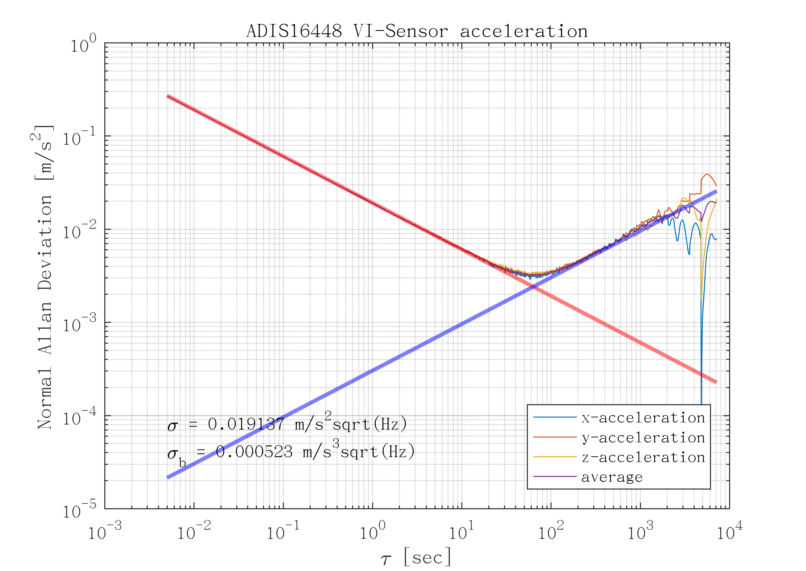
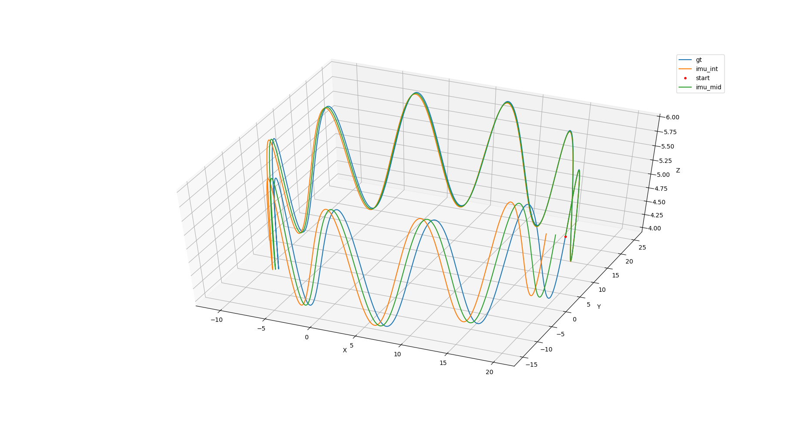

# Week2

实现代码在压缩包里，得到的结果在下面展示

## 生成Allen标定曲线
使用Kalibr_allan标定




## 将imu仿真代码中欧拉积分转换成中值积分
不知道为什么我的结果中值积分比较差，我也是改得vio_data_simulation/src/imu.cpp
里
```buildoutcfg

 /// 中值积分
	if(i>1){
		MotionData imupose_before = imudata[i-1];
		Eigen::Vector3d dtheta_half = ((imupose.imu_gyro+imupose_before.imu_gyro)/2.0)*dt/2.0;
		dq.w() = 1;
		dq.x() = dtheta_half.x();
		dq.y() = dtheta_half.y();
		dq.z() = dtheta_half.z();
		dq.normalize();	
       		
		Eigen::Vector3d acc_w = Qwb * (imupose.imu_acc) + gw;  // aw = Rwb * ( acc_body - acc_bias ) + gw
		Eigen::Vector3d acc_w_before = Qwb * (imupose_before.imu_acc) + gw; 
		Eigen::Vector3d acc_w_mid = (acc_w+acc_w_before)/2.0;
		Qwb = Qwb * dq;
		Pwb = Pwb + Vw * dt + 0.5 * dt * dt * acc_w_mid;
		Vw = Vw + acc_w_mid * dt;
	}
```


